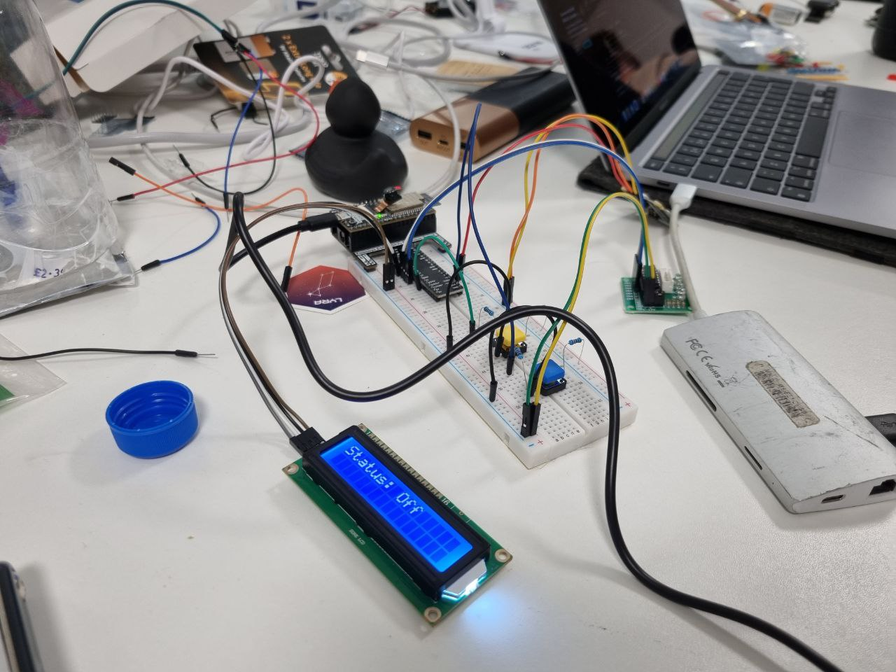
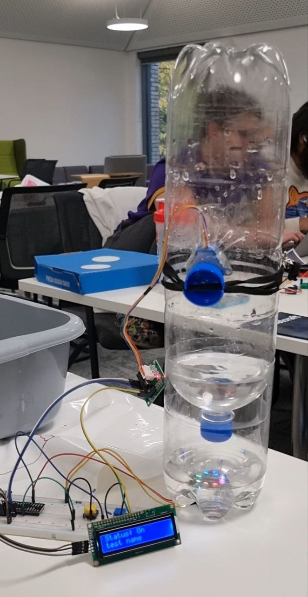

# Bubble Display
## What our project is
Designed software and hardware!
#### Software:
We have developed a program that retrieves a large stream of Binance data from finhub and uses Kafka (learned from the tutorial Marshall Wace provided) to efficiently process that high-volume data stream and implement scalability.
After analysing the transactions data stream, the program outputs the frequency of a chosen transaction type using bubbles.

* Data representation can be a way of art. And this is the way we are going today.
#### Hardware
Used Arduino ESP32 Wrover to control a stepper motor fixed around a water column *of own design*. We send bubbles up the water column in a frequency directly proportional to the volume of a chosen transaction (currency 1 to currency 2) type per 10 seconds.

## Why bubbles?
Infinity -> cosmos (especially in this Durhack's setting) -> What is one of the most important resources for one in outer space? - air. -> bubbles.

Data Visualization: higher frequency data correlates to proportionally higher frequency of bubble production.

# How we built it
-- Went through many prototype iterations. Different motors; different ways to generate bubbles.--

Previous designs involved using a shutter door in between the water chamber (at the top of the column) and the air chamber (at the bottom of the column); and designing a one-way valve (because we surprisingly could not buy any at B&Q) to be placed at the bottom of the water-column only to be opened by the motor from underneath the design to let the air in when bubbles are to be generated. 

## The way of experimentation showed us our solution:
- a sealed vertical water column with a tiny hole at the bottom
	air enters the water column with each motor-generated compression, making bubbles go up in the column.
- filled with water only a third of the way
	this is the equilibrium point where the water volume is light enough to keep its desire to come out of the bottle through the hole (due to gravity) in balance with the surface tension at the chamber opening.
	=> no water comes out in the model's resting state.

## Additional features:
- display showing the current transaction type;
- splash-free design;
	protect the electronics from water by upgrading from using the water column display above a sink (or a bucket) to *a stable water collecting stand*.
- LEDs change colour with each change of the current transaction type shown;
- options of wireless or wired use;

:)
